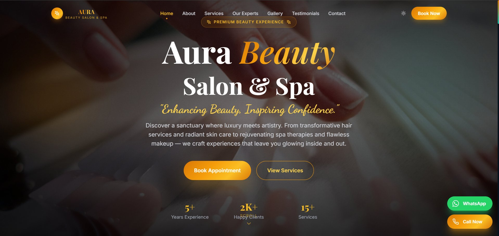
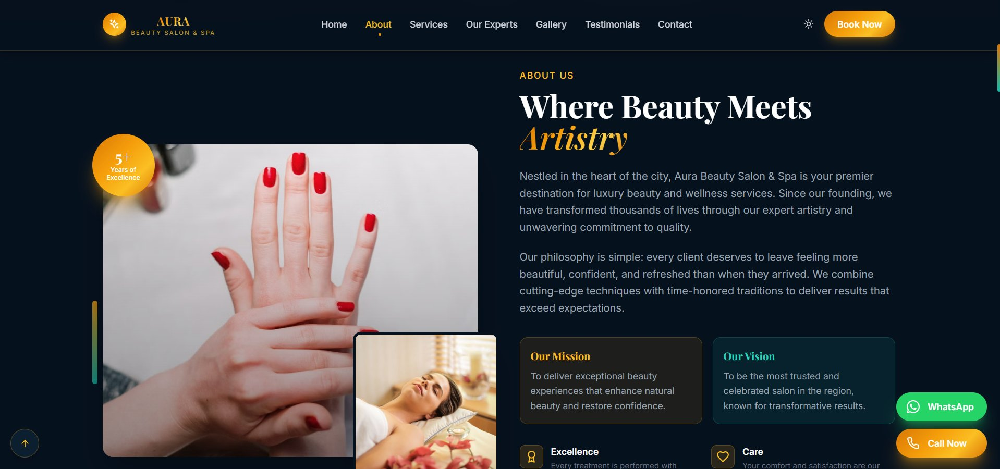
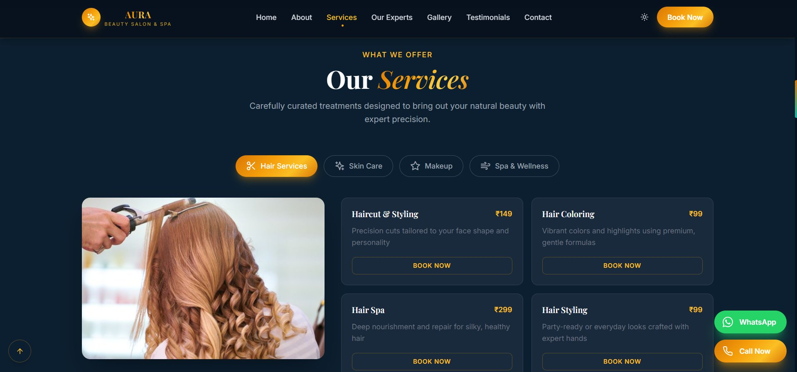
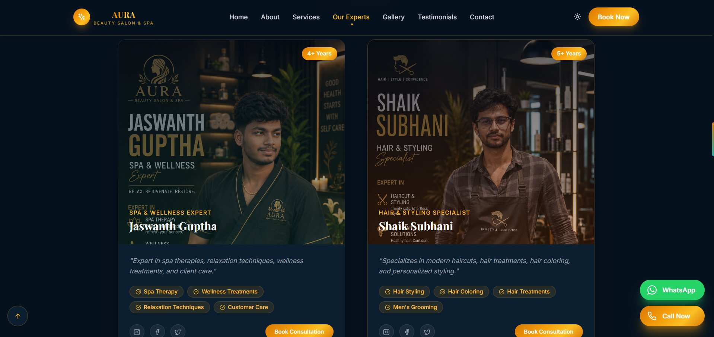
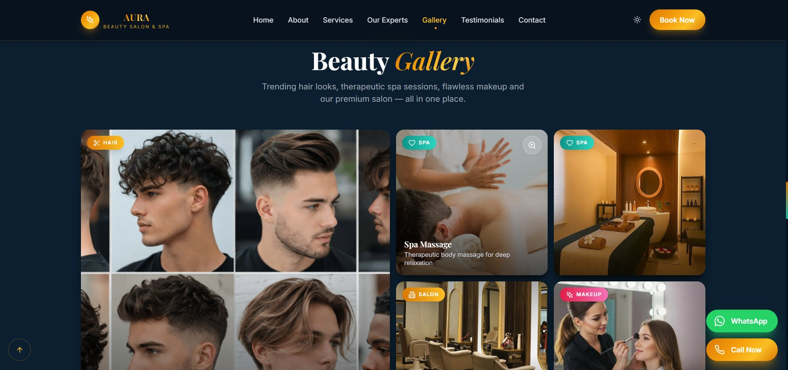
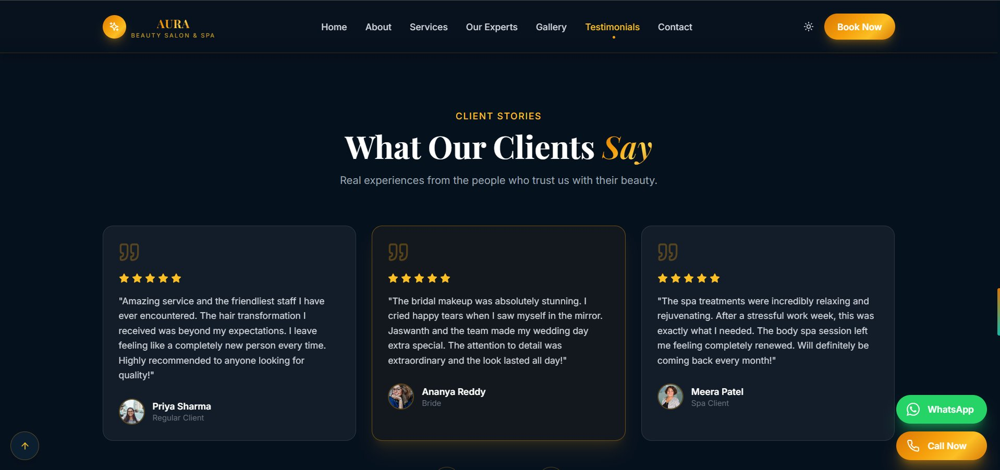
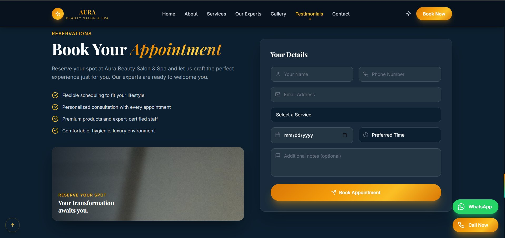
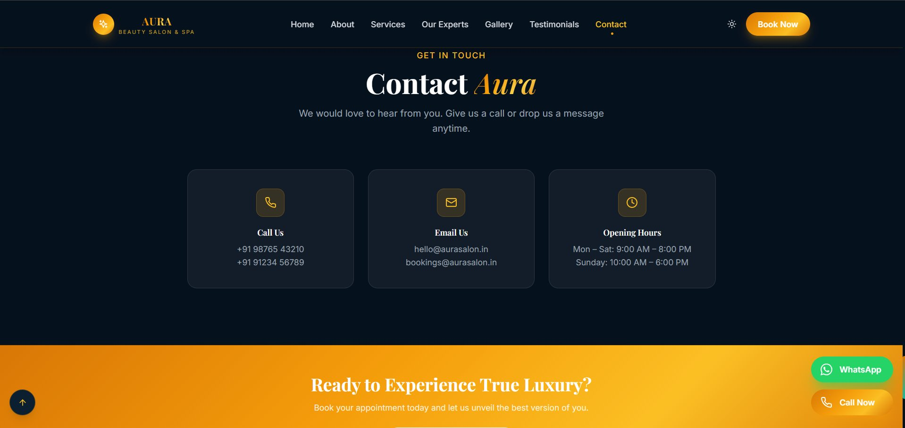

# 💄 Aura Beauty Salon & Spa — Website

> **"Enhancing Beauty, Inspiring Confidence."**  
> A fully responsive, single-page website for a premium beauty salon and spa.

🔗 **Live Demo:** [https://future-fs-03-beta-orpin.vercel.app/](https://future-fs-03-beta-orpin.vercel.app/)

---

## 📸 Screenshots

### 🏠 Hero


### 👤 About


### 💇 Services


### 👨‍🎨 Our Experts


### 🖼️ Gallery


### ⭐ Testimonials


### 📅 Book Appointment


### 📞 Contact


---

## ✨ Features

- **Dark luxury theme** — Deep navy (`#0B1629`) background with gold (`#F5A623`) accents
- **Sticky navigation** with smooth scroll and active section highlighting
- **Light/Dark mode toggle** in the navbar
- **Hero section** with animated text, CTA buttons, and live stat counters (5+ Years, 2K+ Clients, 15+ Services)
- **Tabbed Services section** — Hair Services, Skin Care, Makeup, Spa & Wellness with prices in ₹
- **Expert profiles** — Team cards with skills, experience badges, social links, and "Book Consultation" buttons
- **Beauty Gallery** — Category-tagged photo grid (Hair, Spa, Salon, Makeup)
- **Testimonials carousel** — Client reviews with star ratings and profile photos
- **Appointment booking form** — Name, phone, email, service selection, date/time picker, and notes
- **Floating WhatsApp & Call Now buttons** — Fixed bottom-right quick-contact
- **Back to top button** — Smooth scroll on click
- **SEO meta tags** — Open Graph, Twitter Card, keywords, and theme color

---

## 🗂️ Project Structure

```
FUTURE_FS_03-main/
├── index.html          # Main single-page HTML file
├── css/
│   └── style.css       # All styles (dark theme, animations, responsive)
├── js/
│   └── main.js         # Navbar, scroll, tabs, counters, form logic
├── images/
│   ├── hero/           # Hero background images
│   ├── about/          # About section images
│   ├── services/       # Service category images
│   ├── experts/        # Team member photos
│   ├── gallery/        # Gallery images
│   └── testimonials/   # Client avatar images
└── README.md
```

---

## 🛠️ Tech Stack

| Technology | Usage |
|---|---|
| HTML5 | Semantic page structure |
| CSS3 | Custom properties, Flexbox, Grid, animations |
| Vanilla JavaScript | DOM manipulation, scroll events, tab switching |
| Google Fonts | Cormorant Garamond (serif headings), Inter (body) |
| Font Awesome / Lucide | Icons throughout the UI |
| Vercel | Hosting & deployment |

---

## 🚀 Getting Started

### 1. Clone the repository

```bash
git clone https://github.com/YOUR_USERNAME/FUTURE_FS_03-main.git
cd FUTURE_FS_03-main
```

### 2. Open locally

Simply open `index.html` in your browser — no build step required.

```bash
# Or use a local server (recommended for smooth asset loading)
npx serve .
# or
python -m http.server 5500
```

### 3. Deploy to Vercel

```bash
npm i -g vercel
vercel
```

---

## 📋 Sections Overview

### 🏠 Hero
- Full-viewport background with overlay
- Animated heading: **"Aura Beauty Salon & Spa"**
- Tagline: *"Enhancing Beauty, Inspiring Confidence."*
- Two CTAs: **Book Appointment** (filled) · **View Services** (outlined)
- Animated counters: 5+ Years · 2K+ Clients · 15+ Services

### 👤 About
- "Where Beauty Meets Artistry" heading
- Two-column layout (image + text)
- Mission & Vision cards
- Values: Excellence · Care · Innovation · Trust
- Floating badge: **5+ Years of Excellence**

### 💇 Services
Four tabbed categories, each with image + service cards:

| Tab | Sample Services |
|---|---|
| Hair Services | Haircut & Styling ₹149 · Hair Coloring ₹99 · Hair Spa ₹299 · Hair Styling ₹99 |
| Skin Care | Facial · Cleanup · De-tan · Anti-aging |
| Makeup | Bridal · Party · Natural Glow |
| Spa & Wellness | Body Massage · Foot Spa · Aromatherapy |

### 👨‍🎨 Our Experts
- **Jaswanth Guptha** — Spa & Wellness Expert (4+ Years)  
  Skills: Spa Therapy · Wellness Treatments · Relaxation Techniques · Customer Care
- **Shaik Subhani** — Hair & Styling Specialist (5+ Years)  
  Skills: Hair Styling · Hair Coloring · Hair Treatments · Men's Grooming

### 🖼️ Gallery
Masonry grid with category badges: **HAIR** · **SPA** · **SALON** · **MAKEUP**

### ⭐ Testimonials
- **Priya Sharma** (Regular Client) — Hair transformation
- **Ananya Reddy** (Bride) — Bridal makeup
- **Meera Patel** (Spa Client) — Spa treatments

### 📅 Book Appointment
Form fields: Name · Phone · Email · Service · Date · Preferred Time · Notes

### 📞 Contact

| | |
|---|---|
| 📞 Call | +91 98765 43210 · +91 91234 56789 |
| 📧 Email | hello@aurasalon.in · bookings@aurasalon.in |
| 🕘 Hours | Mon–Sat: 9:00 AM – 8:00 PM · Sunday: 10:00 AM – 6:00 PM |

---

## 🎨 Design Tokens

| Token | Value |
|---|---|
| Primary Gold | `#F5A623` |
| Accent Gold | `#C9956C` |
| Background Dark | `#0B1629` |
| Card Background | `#0F1F35` |
| Text Primary | `#FFFFFF` |
| Text Muted | `rgba(255,255,255,0.7)` |

---

## 📱 Responsive Design

- **Desktop** (≥1024px) — Multi-column layouts, full navigation
- **Tablet** (768px–1023px) — Adjusted grid, collapsible nav
- **Mobile** (≤767px) — Single column, hamburger menu, stacked cards

---

## 🙋 Author

Built as part of the **Future FS 03** frontend project.  
Design inspired by luxury salon branding.

---

## 📄 License

This project is open-source and available under the [MIT License](LICENSE).
